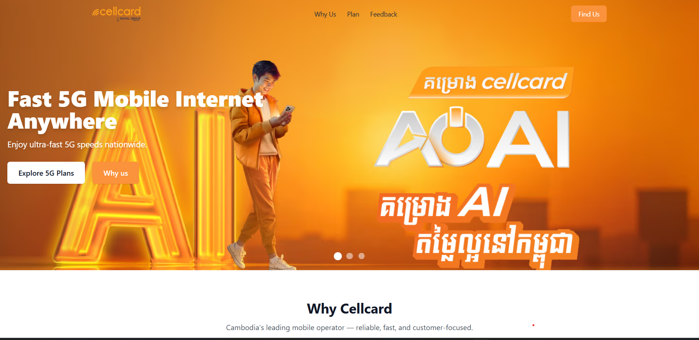
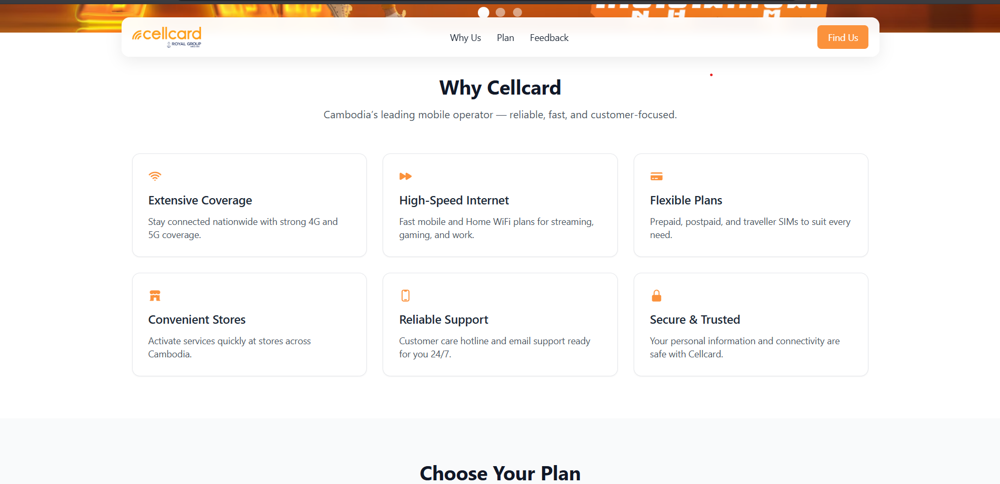
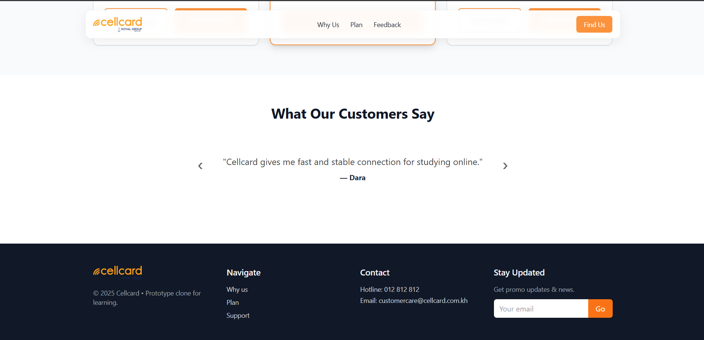
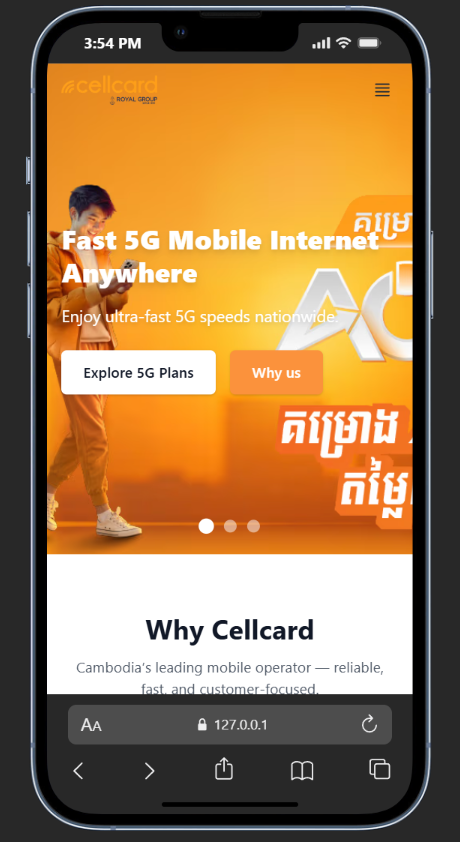
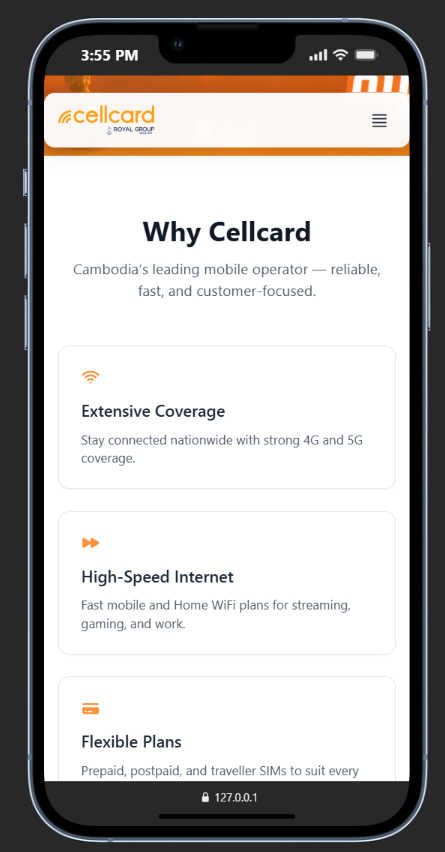
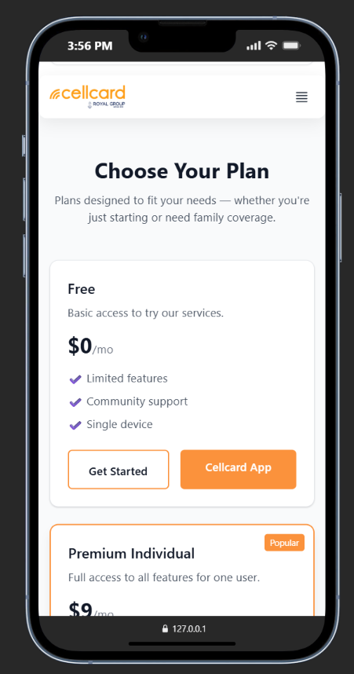
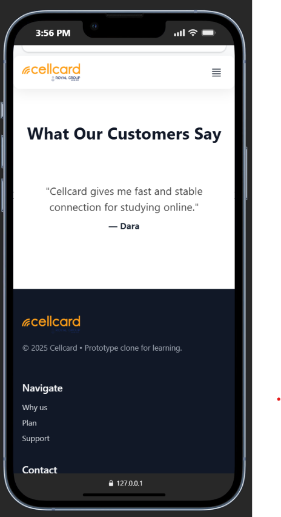

## Cellcard landing page 
Sam Bunheng
https://github.com/Heng1410/cellcard-clone
### Website




### Mobile





---
## List of implemented features
- Fully responsive UI (Desktop, Tablet, Mobile)
- Tailwind CSS (CDN version)
- Smooth scrolling navigation links
- Hero section with Call-To-Action button
- Pricing section with multiple plans
- Why Choose Us section
- About section
- Footer with useful links
- Custom favicon included
- *Some UI ideas and content improvements were assisted using ChatGPT*
---
## Image & Font Credits

- **All images under 200 KB**
- Stored in: `/assets/images/`
- Favicon stored in project root: `favicon.ico`

Image sources used:

- Photos from **Unsplash**
- Photos from **Pexels**
- Hero Photos from **cellcards website**
- Icons from **Heroicons**

1. **Clone this repository**
   ```bash
   git clone https://github.com/Heng1410/cellcard-clone.git
    ```
2. **Navigate to the project folder**
     ```bash
   cd cellcard-clone
    ```
3. **Open the project**
    run the project

🟢 No installation required — this is a static HTML project.

